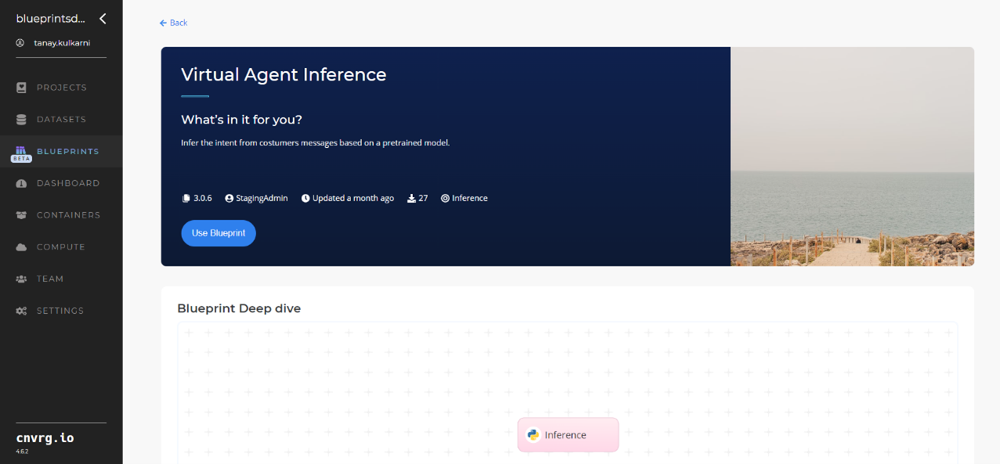
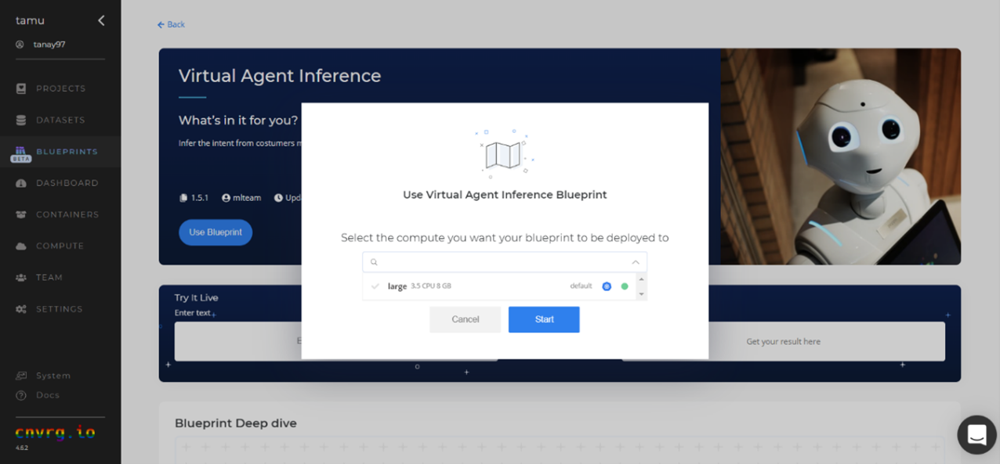
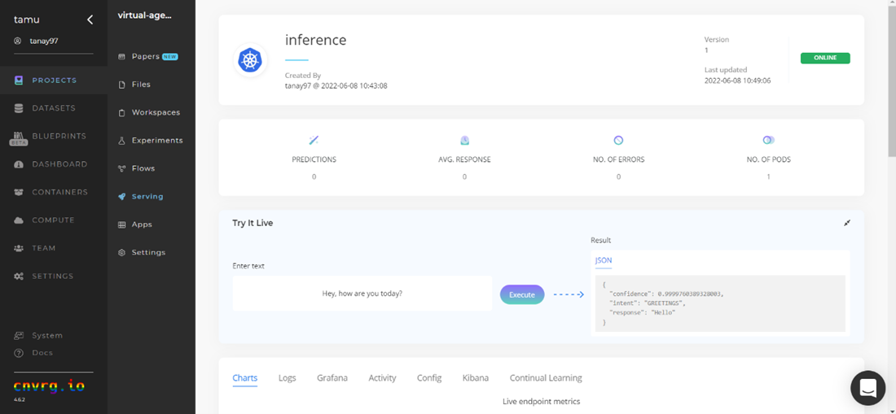
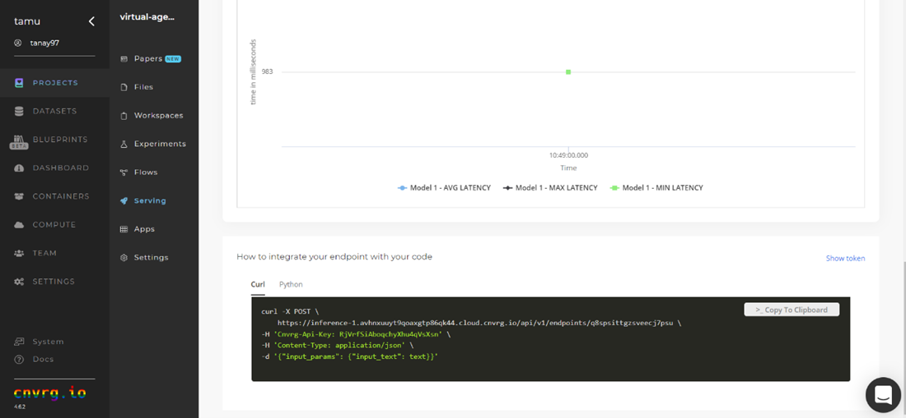

# Virtual Agent (Chatbot) Inference AI Blueprint
A chatbot is a computer program that simulates and processes human conversation, allowing people to interact with digital devices as if they were communicating with a real person. This chatbot's main goal is to serve as a virtual agent that allows businesses to communicate with their customers without requiring human resources.

The topics in this page:
[[TOC]]

## Blueprint Purpose
Use this blueprint to immediately infer the intent of a customer message. To run this pretrained intent recognition model, create a ready-to-use API-endpoint that can be quickly integrated with your data and application.
This inference blueprint's model was trained using e-commerce data. To use custom data according to your specific business, run this counterpart's training blueprint, which trains the model and establishes an endpoint based on the newly trained model.

## Blueprint Modes
The endpoint response contains either the intent only or the intent and an appropriate response (to the message given) with a confidence score. Thus, this blueprint supports the following two modes:
* intent - returns the intent of the given text.
* response - returns a response message relevant to the identified intent based on an intent-response dictionary provided in the environment variable `responses_dict`.Define the mode by defining intent/response in the mode environment variable.
Note: The uploaded inference blueprint includes the default `responses_dict` with the default data, and as such, is not accessible. If users retrain the model using the associated training blueprint, they need to upload their own responses.

The following provides an example `JSON` response from the endpoint:

```
{
    "prediction":
    [
        {
            "response": "How can I help you",
            "intent": "GREETING"
            "confidence": 1.
        }
    ]
}
```
## Inference Instructions
Complete the following steps to deploy the chatbot API endpoint:
1. Click the **Use Blueprint** button. The cnvrg Blueprint Flow page displays.


2.	In the dialog, select the relevant compute to deploy API endpoint.
3.	Click the **Start** button.


4. The cnvrg software redirects to your endpoint. Complete one or both of the following options:
   * Use the Try it Live section with any text to check the model to infer the intent.
   
   * Use the bottom Integration panel to integrate your API with your code by copying in your code snippet.
   

An API endpoint that infers the intents of customer messages has now been deployed.

After cnvrg runs the flow and publishes the endpoint, the code is generated, as shown in the following example snippet:

```
import http.client
conn = http.client.HTTPSConnection("[inference-1.afgvovz3e9wynopge5snpb.staging-cloud.cnvrg.io](http://inference-1.afgvovz3e9wynopge5snpb.staging-cloud.cnvrg.io/)")
payload = "{\"input_params\": {\"input_text\": text}}"
headers = {
'Cnvrg-Api-Key': "wrvpHvpNarpfX1tCCqehAikg",
'Content-Type': "application/json"
}
conn.request("POST", "/api/v1/endpoints/f39x4dhqrzwfhxerwznq", payload, headers)
res = conn.getresponse()
data = res.read()
print(data.decode("utf-8"))
```

## Related Blueprints
Refer to the following blueprints related to this interence blueprint:
- [Sentiment Analysis Inference](https://metacloud.cloud.cnvrg.io/marketplace/blueprints/sentiment-analysis-inference)
- [Slack Connector](https://metacloud.staging-cloud.cnvrg.io/marketplace/libraries/slack-connector/latest)
