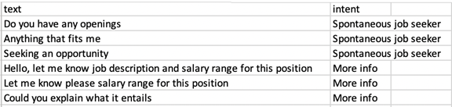

# Virtual Agent (Chatbot) Train AI Blueprint
A chatbot is a computer program that simulates and processes human conversation, allowing people to interact with digital devices as if they were communicating with a real person. This chatbot's main goal is to serve as a virtual agent that allows businesses to communicate with their customers without requiring human resources.

The topics in this page:
[[TOC]]

## Blueprint Overview
The following diagram provides an overview of this blueprint's inputs and outputs.

## Blueprint Purpose
Use this blueprint to train a tailored model that infers the intent of a customer message based on your custom data. To train this model with your data, you need to provide a training dataset, which is a collection of possible messages mapped to their intent.
This blueprint retrains a neural network on the custom dataset. The result is a trained model file that can be used to build a chatbot that meets an organization's needs by detecting customer intents and generating responses accordingly. This blueprint also establishes an endpoint that can be used to make inferences for customer message intents based on the newly trained model.

## Blueprint Deep Dive
The following flow diagram illustrates this blueprint's pipeline:

## Blueprint Flow
The following list provides a high-level flow of this blueprint's run:
* Update the S3 Connector task with the data bucket name and the path to the training dataset. Ensure the dataset is a CSV file having a two column format, with column one containing the text and column two containing the intent, as the following example table illustrates:

* Provide the dataset path in the Train task and train the model on the extended dataset to produce a model file in the Inference task. The trained model can then be used for a personalized business chatbot.

## Blueprint Arguments/Artifacts
### Inputs
* `--data` is the base training dataset.
* `--additional_data` refers to the additional training dataset that contains the data unique to the business.
* `--model_file` is the model's file name.

### Output
* `chatbot_model.pt` is the file that contains the retrained model, which can then be used for detecting the intent of a customer's message.

## Training Instructions
Complete the following steps to train the chatbot model:
1. Click the **Use Blueprint** button. The cnvrg Blueprint Flow page displays.

2. In the flow, click the **S3 Connector** task to display its dialog.
   * Within the **Parameters** tab, provide the following Key/Value information:
   
     - Key: `bucketname` - Value: enter the data bucket name
     - Key: `prefix` - Value: provide the main path where the data folder is located
   * Click the **Advanced** tab to change resources to run the blueprints, as required.
   
   ::: tip NOTE
   The minimum resource recommendation to run this blueprint is ???
   :::

3. Return to the flow and click the **Train** task to display its dialog.
   * Within the **Parameters** tab, provide the S3-Connector path (Value) to the dataset for the `data` Key parameter.
   
   ::: tip NOTE
   This path refers to the base training data, not data for fine-tuning the model. The following link stores the default base training data: http://s3.amazonaws.com. Also, use the `--additional_data` parameter to include business-specific data for training.
   :::
   * Click the **Advanced** tab to change resources to run the blueprints, as required.
   
   ::: tip NOTE
   The minimum resource recommendation to run this blueprint is ???
   :::
4.	Click the blue **Run** button.

In a few minutes, cnvrg trains a new text intent detection model and deploys it as a new API endpoint.
For more information on cnvrg endpoint deployment capability, see [cnvrg Serving](https://app.cnvrg.io/docs/core_concepts/endpoints.html#serving).

5. Track the blueprint's real-time progress in its Experiment page, where artifacts such as logs, metrics, hyperparameters, and algorithms are displayed.

6. Click the **Serving** tab in the project and locate your endpoint.
7. Complete one or both of the following options:
   * Use the Try it Live section with any text to check the model to infer the intent.
   
- [Virtual Agent Train](https://metacloud.cloud.cnvrg.io/marketplace/libraries/virtual-agent-train/1.7.12)
- [Virtual Agent Inference](https://metacloud.cloud.cnvrg.io/marketplace/libraries/virtual-agent-inference/1.7.12)

## Related Blueprints
Refer to the following blueprints related to this training blueprint:
- [Sentiment Analysis Train](https://metacloud.cloud.cnvrg.io/marketplace/blueprints/sentiment-analysis-train)
- [Slack Connector](https://metacloud.staging-cloud.cnvrg.io/marketplace/libraries/slack-connector/latest)
